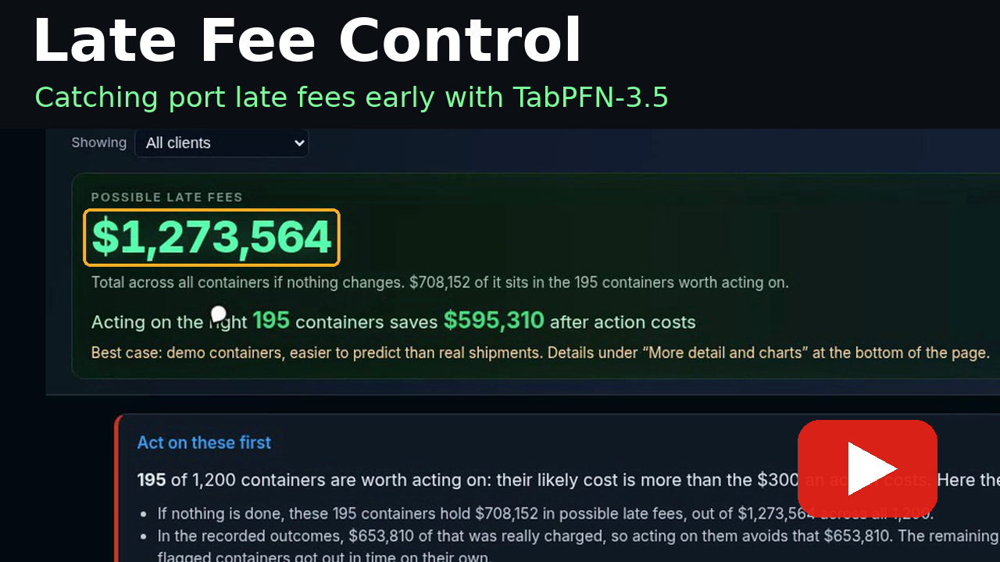

<!-- TIP_SHA_PIN_START -->
[](https://youtu.be/_aIq96WwLF0)

**Judged version:** git tag `submit`
<!-- TIP_SHA_PIN_END -->

<!-- FREIGHT_FACE_START -->
# Late Fee Control: a freight late-fee desk on TabPFN-3.5

Every day a container sits at the port past its free days, the shipper pays a late fee. This desk flags which containers are headed for those fees before the bill shows up, puts a dollar figure on each, and says what to do: push for early pickup, move it to another terminal, speed up the inland move, or book it on the next ship.

**TabPFN-3.5 Plus ranks late-fee risk at AUC 0.911, against 0.873 for HistGBM (scikit-learn's standard gradient-boosting model, the usual default for tables like this). At $300 per action, its picks save $595,310, which is $159,723 more than HistGBM's.**

> **Read this before the numbers.** The 1,200 containers are synthetic, generated from demurrage rules, the same way TabPFN itself learned from synthetic tables; real shipments will differ. Three columns that nearly gave the answer away (`projected_demurrage_usd`, `fee_inevitable`, `cargo_vs_fee_collapse`) plus the ID and timestamp columns are removed from what the models see. An earlier run that kept them scored AUC 0.987; we report the clean run. The dollar math still uses `projected_demurrage_usd` as the fee at stake, to decide what's worth acting on and to value each save. (receipt: `artifacts/freight-demurrage/replay_tabpfn_oof_receipt.json`)

**Every container scored by a model that never saw it (12 kept columns, 5 folds grouped by vessel, seed 42):**

| | AUC | Avg precision | Net saved at $300/action | Actions |
|---|---|---|---|---|
| TabPFN-3.5 Plus | **0.911** | 0.833 | **$595,310** | 195 |
| TabPFN-3.5 Thinking | 0.903 | 0.840 | $467,247 | 195 |
| TabPFN-3.5 Fast | 0.901 | 0.816 | $567,532 | 202 |
| HistGBM baseline | 0.873 | 0.764 | $435,587 | 180 |
| Act on everything | | | $611,792 | 1,200 |
| Perfect foresight | | | $914,480 | |

Plus recovers **65.1%** of perfect foresight ($595,310 / $914,480); HistGBM recovers **47.6%** ($435,587 / $914,480).

**If actions cost more, being picky matters more:**

| Cost per action | TabPFN-3.5 Plus | HistGBM | Act on everything |
|---|---|---|---|
| $300 | $595,310 | $435,587 | $611,792 |
| $500 | $461,792 | $407,964 | $371,792 |
| $1,000 | $334,548 | $217,928 | −$228,208 |

**What the desk tells you to do:** 195 of 1,200 containers are worth acting on, holding $708,152 of the $1,273,564 in possible late fees. They split into Push for early pickup (87, $523,504), Move to another terminal (91, $161,837), Speed up inland move (11, $16,795) and Book on the next ship (6, $6,015). This assumes every action costs the stated amount and fully stops the fee when one would have been charged; real actions will sometimes cost more or fail.

**One container:** CONT-000121 later ran up an $11,308 fee. TabPFN-3.5 Plus gave it a 26.80% chance ($3,031 likely cost) and the desk flagged **Push for early pickup**. HistGBM gave it 2.5% and would have let it go.

**Where it misses:** CONT-000721 ran up a $40,832 fee and TabPFN-3.5 Plus and Thinking scored it under 2% and HistGBM under 1%. Its row looks routine: 4.7 free days left, under 6 days at the port, no weather or blank-sailing flag. Its fee is exactly half its cargo value, a pattern only the removed columns carried.

**With only 30 containers of history,** TabPFN-3.5 Plus already ranks risk (AUC 0.746) while default HistGBM can't fit yet (AUC 0.500; its minimum leaf size blocks every split). That matches what the video says: with thirty past shipments, the common tool still can't tell risky from safe, and ours already can.

**Run it without a token:** plays back the recorded TabPFN-3.5 run.
```
git clone https://github.com/DevMatrixAi/tabpfn-freight-demurrage.git && cd tabpfn-freight-demurrage
python3 -m venv .venv && .venv/bin/pip install -e ".[dev,desk]"
TABPFN_TOKEN= .venv/bin/tabpfn-hack desk --host 127.0.0.1 --port 8765
```
Open http://127.0.0.1:8765 and log in with `demo` / `demurrage`. With a token, score live instead: `DESK_REPLAY=0 TABPFN_TOKEN=YOUR_TOKEN .venv/bin/tabpfn-hack desk --host 127.0.0.1 --port 8765`. Tests: `TABPFN_TOKEN= .venv/bin/python -m pytest -q`.

**Video:** [https://youtu.be/_aIq96WwLF0](https://youtu.be/_aIq96WwLF0) (demo video, unlisted on YouTube).

## Appendix: learning curve (below the fold)

**Learning curve on the clean features** (`artifacts/freight-demurrage/learning_curve_clean12_*`): Plus only leads at n=30 (0.746 vs 0.500, while HistGBM can't fit). A working HistGBM is ahead at 60 rows (0.924 vs 0.798) and 120 rows (0.881 vs 0.825); they tie at 240 (0.939 vs 0.937). We claim only the 30-row case above.
<!-- FREIGHT_FACE_END -->

## How judges demo in 3 minutes

One-pager: [`docs/JUDGE_3MIN.md`](docs/JUDGE_3MIN.md) · MCP smoke: [`docs/MCP_SMOKE.md`](docs/MCP_SMOKE.md).

**Fastest honest path = local full desk** (deep panels live here). The public Vercel URL is a **mock stub only**.

| Min | Do this |
| --- | --- |
| 0:00 | `pip install -e ".[dev,desk]"` then `TABPFN_TOKEN= .venv/bin/tabpfn-hack desk --host 127.0.0.1 --port 8765` (recorded replay, no token) |
| 0:30 | Open http://127.0.0.1:8765 → login `demo` / `demurrage` → **Run triage** (replay) → risk cards + HistGBM Δ; star CONT-000121 |
| 1:30 | Open **/eval** → **Run eval** → latency · Thinking · ablations · calibration · small-n learning curve |
| 2:30 | Optional: `TABPFN_TOKEN= python scripts/mcp_cookbook_demo.py` (7 MCP tools) · `TABPFN_TOKEN= pytest -q` · `tabpfn-hack demo --mode mock` |


Settings stub: `/settings`.

**Live budget:** desk `sample_n` 40–80 (or `TABPFN_DEV_N=60`) for Plus/Thinking after API reset; full-table mock anytime.

**Preflight:** `TABPFN_TOKEN= python scripts/preflight_live_budget.py --mock` before small-n Thinking (blocks full-table live).

**Deterministic mock path:** keep the inline `TABPFN_TOKEN=` on the local desk command.
The app loads a repo `.env` for convenience; an explicitly empty variable prevents an
unintended live request/rate limit and keeps the 3-minute walkthrough offline. Never
commit `.env`.

**Stub URL honesty:** [https://tabpfn-freight-demurrage.vercel.app](https://tabpfn-freight-demurrage.vercel.app) shows login + sample ticker only — **not** Jinja `/eval` or robot triage. Full TabPFN desk stays local (or Docker/Fly/Railway). Never commit `.env`.


## Robot / TMS consumer API

**Humans or robots call the same action API.** Desk serves JSON under `/api/v1/*` that wraps TabPFN `suggest_actions` / triage (honest: **decisions API**, not crane control). Mock works without a token; Plus/Thinking when `TABPFN_TOKEN` is set. See [`docs/ROBOT_API.md`](docs/ROBOT_API.md) and OpenAPI at `/docs`.

```bash
tabpfn-hack desk --host 127.0.0.1 --port 8765
curl -s http://127.0.0.1:8765/api/v1/health
curl -s -X POST http://127.0.0.1:8765/api/v1/triage \
  -H 'content-type: application/json' \
  -d '{"pack":"freight-demurrage","mode":"mock"}'
```

## Multi-desk note

**Spine:** `domains/freight-demurrage/` — demurrage triage is the default desk story.  
**Coda packs** (same engine, fixtures only — not live TOS):

| Pack | Path | Mock demo (no token) |
| --- | --- | --- |
| Equipment size (box / TEU / reefer vs dry) | [`domains/equipment-size/`](domains/equipment-size/) | `tabpfn-hack demo --domain domains/equipment-size/domain.yaml` |
| Inland truck vs rail | [`domains/inland-mode/`](domains/inland-mode/) | `tabpfn-hack demo --domain domains/inland-mode/domain.yaml` |
| Air freight (AOG / connection / belly) | [`domains/air-freight/`](domains/air-freight/) | `tabpfn-hack demo --domain domains/air-freight/domain.yaml --mode mock` |
| Stow-fit (equip/mode suggest head) | [`domains/stow-fit/`](domains/stow-fit/) | `tabpfn-hack demo --domain domains/stow-fit/domain.yaml --mode mock` |

**Ops board desk:** dollar ticker + green/amber/red risk cards; Plus | Thinking | Mock + HistGBM Δ stays the judge card. Pack selector includes demurrage (spine) + coda packs (equipment-size, inland-mode, air-freight, stow-fit). Chargeback remains an extra story under `domains/chargeback-desk/`. Stow-fit is a tabular suggestion head — **not** a 3D bin packer.

# Engine: tabpfn-hack-core

**Raw DataFrame in:** CSV / fixture adapters land as a pandas table via `load_table` — no custom featurizer. Text, high-cardinality IDs, and missings stay as columns; Thinking adds `group_col` / `group_time_col`.

**Domain-agnostic TabPFN-3.5 MCP + CLI** — mock demo / pytest / MCP cookbook:

```bash
pip install -e ".[dev,desk]"
tabpfn-hack demo --domain domains/freight-demurrage/domain.yaml --mode mock
pytest
python scripts/mcp_cookbook_demo.py
tabpfn-hack desk --host 127.0.0.1 --port 8765
```

Deep panels: [`docs/DEEP_SHOWCASE.md`](docs/DEEP_SHOWCASE.md). Preview honesty: [`docs/PREVIEW.md`](docs/PREVIEW.md).
