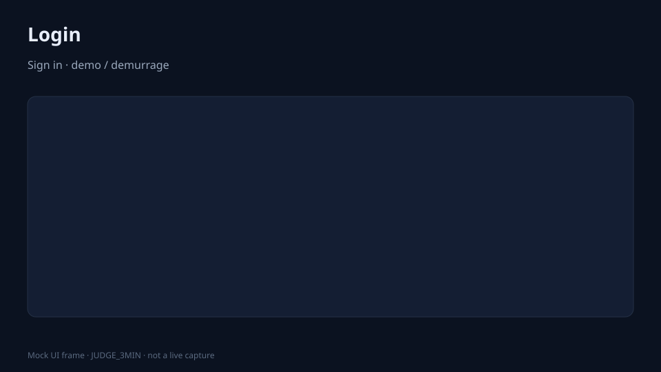
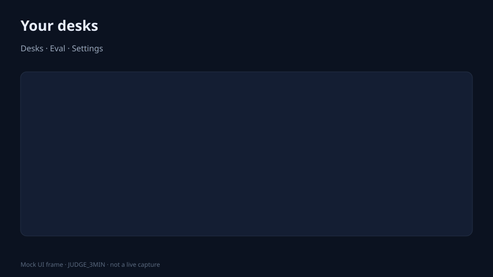
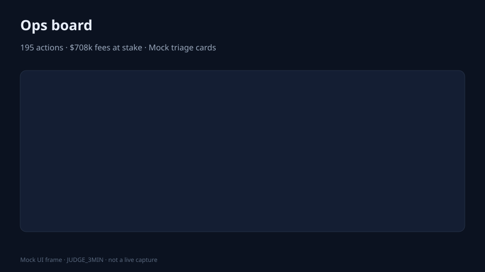
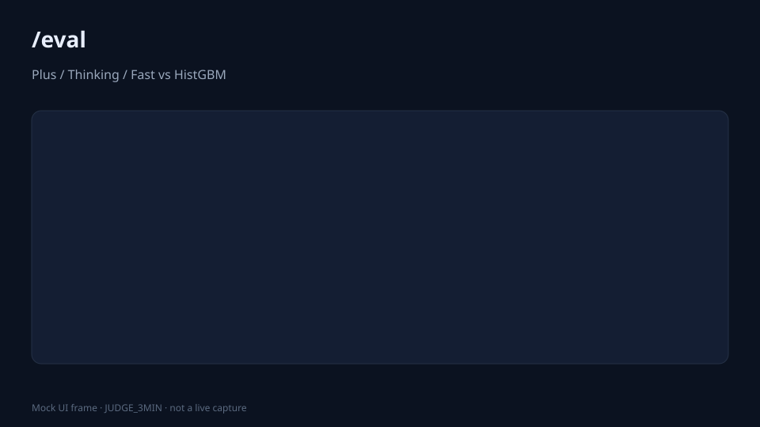

<!-- TIP_SHA_PIN_START -->
**Tip (main):** `b0ce904` · [judge_path_mock_receipt.md](../artifacts/freight-demurrage/judge_path_mock_receipt.md)

**First-screen gallery:**

| Login | Home | Desk | Eval |
| --- | --- | --- | --- |
|  |  |  |  |
<!-- TIP_SHA_PIN_END -->

# Judge path — 3 minutes (offline mock)

**Honest path = local full desk.** The Vercel URL is a login + sample-ticker stub only.

Credentials: `demo` / `demurrage`. Never commit `.env`. Keep `TABPFN_TOKEN=` empty on these commands so mock stays deterministic (no live 429s).

| Min | Do this |
| --- | --- |
| 0:00 | `pip install -e ".[dev,desk]"` then `TABPFN_TOKEN= tabpfn-hack desk --host 127.0.0.1 --port 8765` |
| 0:30 | http://127.0.0.1:8765 → login → **Run triage** (Mock) → money-at-risk cards + HistGBM Δ |
| 1:30 | Open **/eval** → **Run eval** → Plus/Thinking/Fast vs HistGBM, latency, ablations, calibration, **small-n learning curve** |
| 2:20 | Optional: `TABPFN_TOKEN= python scripts/robot_api_smoke.py` (robot/TMS health+triage) |
| 2:30 | Optional: `TABPFN_TOKEN= python scripts/mcp_cookbook_demo.py` (7 tools) · see [`MCP_SMOKE.md`](MCP_SMOKE.md) · `TABPFN_TOKEN= pytest -q` |

**What to point at (50% showcase):** text / high-card / missings on vessel tables · Thinking group/time narrative · Plus Δacc vs HistGBM · playbook money moves · robot API same actions.

**Stress missingness (optional):** load `fixtures/stress/missing_wide_demurrage.csv` (or unpack via `fixtures/stress/_unpack_missing_wide.py`) — desk shows a missingness panel when NaNs are present.

More depth: [`DEEP_SHOWCASE_v0.md`](DEEP_SHOWCASE_v0.md) · preview honesty: [`PREVIEW.md`](PREVIEW.md).

## Live budget (after API reset)

Prefer **small-n live** Thinking/Plus: desk `sample_n` 40–80, or env `TABPFN_DEV_N=60`.
Full-table mock anytime (`TABPFN_TOKEN=`). One full live Thinking pass near shoot/submit only.

## First-screen screenshots (mock UI frames)

Labeled **mock UI frames** for the 3-minute path (not live browser captures). Dark theme matches the desk crib.

| Screen | Image |
| --- | --- |
| Login |  |
| Home desks |  |
| Ops board |  |
| /eval pre-run |  |

Also: Settings at `/settings` (demo prefs · mode badge · judge crib).
